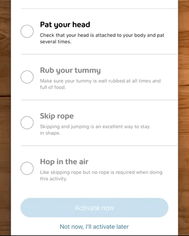

# Enums for Style and State



I recently had to build a view that enabled a user to walk down a tappable list, and then walk back up selecting and deselecting view components as he or she went. Taking some inspiration from by buddy Dan, I solved this using enums, and in this post I would like to show you how.

## Enums for style

The first thing to note is that each of those views you see being tapped is common view, where all we are changing is the style on each tap press. That state the keeps track of what style the row should be in is captured as an enum.

```swift
    enum Style {
        case nextTappable
        case untappable
        case tappedActive
        case tappedUntappable
    }
```

And then applied on the style property `didSet`.

```swift
class ActivationCheckmarkView: UIView {

    let topDivider = UIView()
    let offCheckBox = UIImageView(image: UIImage(named: "activation-inactive-circle"))
    let onCheckBox = UIImageView(image: UIImage(named: "activation-checkmark"))
    let headerLabel = UILabel()
    let subheaderLabel = UILabel()
    let bottomDivider = UIView()

    enum Style {
        case nextTappable
        case untappable
        case tappedActive
        case tappedUntappable
    }

    var style: Style = .nextTappable {
        didSet {
            switch style {
            case .nextTappable:
                onCheckBox.isHidden = true
                headerLabel.textColor = .black
                subheaderLabel.textColor = .black
            case .tappedActive, .tappedUntappable:
                onCheckBox.isHidden = false
                headerLabel.textColor = .black
                subheaderLabel.textColor = .black
            case .untappable:
                onCheckBox.isHidden = true
                headerLabel.textColor = .gray
                subheaderLabel.textColor = .gray
            }
        }
    }
```
    
OK so that's pretty cool. Capturing style state in the form of an enum, and then using it to style a row. But we can take it farther than that. Look what happens in the view controller, holding this view, when we tap a row.
    
## Enums for State

This checkmark row views are stored in a `UIStackViewController` called `listView`. And when we pull the `previous`, `current`, and `next` rows based on where the user has tapped, we can set the style on each view appropriately.


```swift
    class ActivateViewController: UIViewController {
       ...
       
    @objc func didTapListItem(_ recognizer: UITapGestureRecognizer) {
        guard let currentView = recognizer.view as? ActivationCheckmarkView else { return }
        guard let index = listView.arrangedSubviews.firstIndex(of: currentView) else { return }
        
        let nextView = listView.arrangedSubviews[index.advanced(by: 1), default: nil] as? ActivationCheckmarkView
        let previousView = listView.arrangedSubviews[index.advanced(by: -1), default: nil] as? ActivationCheckmarkView

        switch currentView.style {
        case .nextTappable:
            currentView.style = .tappedActive
            nextView?.style = .nextTappable
            previousView?.style = .tappedUntappable
        case .tappedActive:
            currentView.style = .nextTappable
            nextView?.style = .untappable
            previousView?.style = .tappedActive
        case .untappable, .tappedUntappable:
            break
        }

        if lastRow(index: index) {
            if currentView.style == .tappedActive {
                footerView.primaryButton.alpha = 1.0
                footerView.primaryButton.isUserInteractionEnabled = true
            } else {
                footerView.primaryButton.alpha = hiddenAlpha
                footerView.primaryButton.isUserInteractionEnabled = false
            }
        }
    }
```

The magic happens in these lines of code here.

```swift
        switch currentView.style {
        case .nextTappable:
            currentView.style = .tappedActive
            nextView?.style = .nextTappable
            previousView?.style = .tappedUntappable
        case .tappedActive:
            currentView.style = .nextTappable
            nextView?.style = .untappable
            previousView?.style = .tappedActive
        case .untappable, .tappedUntappable:
            break
        }
```

By taking the current view of the row that was tapped, and switching on its style, we can set the next and previous rows style really elegantly.

I found using enums this way to be an elegant way to represent the state and style of view, and it worked well with suprisingly little logic or code.

Happy coding! 🤖
    
